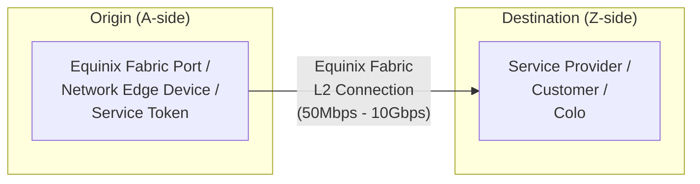

# Equinix Fabric L2 Connection Terraform module

[](https://github.com/equinix-labs/standards#about-uniform-standards)
[](https://github.com/equinix-labs/terraform-equinix-template/actions/workflows/integration.yaml)

`terraform-equinix-fabric-connection` is a minimal Terraform module that
utilizes the [Terraform provider for Equinix](https://registry.terraform.io/providers/equinix/equinix/latest)
to set up an Equinix Fabric L2 connection.

As part of Platform Equinix, your infrastructure can connect with other
parties, such as public cloud providers, network service providers, or your own
colocation cages in Equinix by defining an [Equinix Fabric - software-defined interconnection](https://docs.equinix.com/en-us/Content/Interconnection/Fabric/Fabric-landing-main.htm).



--> **NOTE:**
To establish an Equinix Fabric connection, you need to combine and configure
various parameters based on the types of origin and destination. Additionally,
you must configure the platform of the service you are connecting to, such as
creating an Interconnect Attachment in Google Cloud platform or approving a
Direct Connect request in AWS. While this module can be utilized independently,
its primary purpose is to be utilized by other service-specific modules. This
abstraction simplifies the process and includes all the required configuration
on the target platform.

Please click on the link below to explore the available service-specific
modules:

[Available service-specific modules](https://registry.terraform.io/search/modules?namespace=equinix-labs&q=fabric-connection)

## Usage

Please note that this project is experimental and is supported by the user
community. Equinix does not provide support for this project.

To install Terraform, please refer to the official guides at [Install Terraform](https://learn.hashicorp.com/tutorials/terraform/install-cli).

You are free to fork, clone, or download this project and modify it as needed
for your integrations and deployments.

Additionally, you can use this project as a [Terraform module](https://learn.hashicorp.com/collections/terraform/modules).

To utilize this module in a new project, create a file such as:

```hcl
# main.tf
provider "equinix" {}

module "equinix_fabric_connection" {
  source = "equinix-labs/fabric-connection/equinix"

  # required variables
  notification_users = ["example@equinix.com"]

  # optional variables
  seller_profile_name      = "Azure ExpressRoute"
  seller_metro_code        = "FR"
  seller_authorization_key = "Express-Route-Service-Key"
  port_name                = "Fabric-Port-FR-Pri"
  vlan_stag                = 1010
  named_tag                = "PRIVATE"
  redundancy_type          = "REDUNDANT"
  secondary_port_name      = "Fabric-Port-FR-Sec"
  secondary_vlan_stag      = 1020
}
```

Run `terraform init -upgrade` and `terraform apply`.

<!-- BEGIN_TF_DOCS -->
## Requirements

| Name | Version |
|------|---------|
| <a name="requirement_terraform"></a> [terraform](#requirement\_terraform) | >= 0.13 |
| <a name="requirement_equinix"></a> [equinix](#requirement\_equinix) | ~> 1.14 |
| <a name="requirement_random"></a> [random](#requirement\_random) | 3.6.0 |

## Providers

| Name | Version |
|------|---------|
| <a name="provider_equinix"></a> [equinix](#provider\_equinix) | ~> 1.14 |
| <a name="provider_random"></a> [random](#provider\_random) | 3.6.0 |

## Modules

No modules.

## Resources

| Name | Type |
|------|------|
| [equinix_fabric_connection.primary](https://registry.terraform.io/providers/equinix/equinix/latest/docs/resources/fabric_connection) | resource |
| [equinix_fabric_connection.secondary](https://registry.terraform.io/providers/equinix/equinix/latest/docs/resources/fabric_connection) | resource |
| [random_string.this](https://registry.terraform.io/providers/hashicorp/random/3.6.0/docs/resources/string) | resource |
| [equinix_fabric_ports.primary](https://registry.terraform.io/providers/equinix/equinix/latest/docs/data-sources/fabric_ports) | data source |
| [equinix_fabric_ports.secondary](https://registry.terraform.io/providers/equinix/equinix/latest/docs/data-sources/fabric_ports) | data source |
| [equinix_fabric_ports.zside](https://registry.terraform.io/providers/equinix/equinix/latest/docs/data-sources/fabric_ports) | data source |
| [equinix_fabric_service_profiles.sp](https://registry.terraform.io/providers/equinix/equinix/latest/docs/data-sources/fabric_service_profiles) | data source |

## Inputs

| Name | Description | Type | Default | Required |
|------|-------------|------|---------|:--------:|
| <a name="input_notification_users"></a> [notification\_users](#input\_notification\_users) | A list of email addresses used to notify all connection configuration or status changes. One of<br>  'notification\_users' or 'notification\_users\_by\_type' is required. This is equivalent to adding a<br>  list to 'notification\_users\_by\_type' with the key type ALL. | `list(string)` | n/a | yes |
| <a name="input_additional_info"></a> [additional\_info](#input\_additional\_info) | Additional parameters required for some connections. It should be a list of maps containing<br>  'name' and 'value  e.g. `[{ name='asn' value = '65000'}, { name='ip' value = '192.168.0.1'}]`. | <pre>list(object({<br>    name  = string,<br>    value = string<br>    })<br>  )</pre> | `[]` | no |
| <a name="input_connection_type"></a> [connection\_type](#input\_connection\_type) | Defines the connection type like EVPL\_VC, EPL\_VC, IP\_VC, ACCESS\_EPL\_VC, IA\_VC, EVPLAN\_VC,<br>  EPLAN\_VC, IPWAN\_VC. If not specified, it will be inferred based on access point types.<br>  In cases where the type cannot be identified based on these parameters, the default value will<br>  be 'EVPL\_VC'. | `string` | `""` | no |
| <a name="input_name"></a> [name](#input\_name) | Name of the connection resource that will be created. It will be auto-generated if not<br>  specified. | `string` | `""` | no |
| <a name="input_named_tag"></a> [named\_tag](#input\_named\_tag) | The type of peering to set up in case when connecting to Azure Express Route. One of 'PRIVATE',<br>  'MICROSOFT'. | `string` | `""` | no |
| <a name="input_network_edge_id"></a> [network\_edge\_id](#input\_network\_edge\_id) | Unique identifier of the Network Edge virtual device from which the connection would<br>  originate. | `string` | `""` | no |
| <a name="input_network_edge_interface_id"></a> [network\_edge\_interface\_id](#input\_network\_edge\_interface\_id) | Applicable with 'network\_edge\_id', identifier of network interface on a given device, used for a<br>  connection. If not specified then first available interface will be selected. | `number` | `0` | no |
| <a name="input_network_edge_secondary_id"></a> [network\_edge\_secondary\_id](#input\_network\_edge\_secondary\_id) | Unique identifier of the Network Edge virtual device from which the secondary connection would<br>  originate. If not specified, and 'network\_edge\_id' is specified, and 'redundancy\_type' is<br>  'REDUNDANT' then primary edge device will be used. | `string` | `""` | no |
| <a name="input_network_edge_secondary_interface_id"></a> [network\_edge\_secondary\_interface\_id](#input\_network\_edge\_secondary\_interface\_id) | Applicable with 'network\_edge\_id' or 'network\_edge\_secondary\_id', identifier of network interface<br>  on a given device, used for a connection. If not specified then first available interface will be<br>  selected. | `number` | `0` | no |
| <a name="input_notification_users_by_type"></a> [notification\_users\_by\_type](#input\_notification\_users\_by\_type) | A map where each key represents a notification type (e.g., 'BANDWIDTH\_ALERT', 'ALL') and the<br>  value is a list of email addresses. This structure allows for the categorization of email<br>  addresses based on the type of notification they should receive. One of<br>  'notification\_users\_by\_type' or 'notification\_users' is required. Valid map keys are: ALL,<br>  BANDWIDTH\_ALERT, CONNECTION\_APPROVAL, PROFILE\_LIFECYCLE, SALES\_REP\_NOTIFICATIONS. | `map(list(string))` | `{}` | no |
| <a name="input_port_name"></a> [port\_name](#input\_port\_name) | Name of the buyer's port from which the primary connection would originate. One of 'port\_name',<br>  'network\_edge\_id' or 'service\_token\_id' is required. | `string` | `""` | no |
| <a name="input_purchase_order_number"></a> [purchase\_order\_number](#input\_purchase\_order\_number) | Connection's purchase order number to reflect on the invoice. | `string` | `""` | no |
| <a name="input_redundancy_type"></a> [redundancy\_type](#input\_redundancy\_type) | Whether to create a single connection or redundant. Fabric secondary variables will take no<br>  effect unless value 'REDUNDANT' is specified. | `string` | `"SINGLE"` | no |
| <a name="input_secondary_name"></a> [secondary\_name](#input\_secondary\_name) | Name of the secondary connection that will be created. It will be auto-generated<br>  if not specified. | `string` | `""` | no |
| <a name="input_secondary_port_name"></a> [secondary\_port\_name](#input\_secondary\_port\_name) | Name of the buyer's port from which the secondary connection would originate. If not specified,<br>  and 'port\_name' is specified, and 'redundancy\_type' is 'REDUNDANT', then the value of 'port\_name'<br>  will be used. | `string` | `""` | no |
| <a name="input_secondary_seller_authorization_key"></a> [secondary\_seller\_authorization\_key](#input\_secondary\_seller\_authorization\_key) | Text field used to authorize secondary connection on the provider side. Value depends on a<br>  provider service profile used for connection. | `string` | `""` | no |
| <a name="input_secondary_seller_metro_code"></a> [secondary\_seller\_metro\_code](#input\_secondary\_seller\_metro\_code) | Metro code where the secondary connection will be created. If not specified then primary<br>  connection metro code will be used. | `string` | `""` | no |
| <a name="input_secondary_seller_metro_name"></a> [secondary\_seller\_metro\_name](#input\_secondary\_seller\_metro\_name) | Metro name where the secondary connection will be created, i.e. 'Frankfurt', 'Silicon Valley',<br>  'Ashburn'. If not specified then primary connection metro name will be used. | `string` | `""` | no |
| <a name="input_secondary_seller_region"></a> [secondary\_seller\_region](#input\_secondary\_seller\_region) | The region in which the seller port resides, i.e. 'eu-west-1'. If not specified then primary<br>  connection region will be used. | `string` | `""` | no |
| <a name="input_secondary_service_token_id"></a> [secondary\_service\_token\_id](#input\_secondary\_service\_token\_id) | Unique Equinix Fabric key shared with you by a provider that grants you authorization to use<br>  their interconnection asset from (a-side) which the secondary connection would originate.<br>  Required if 'service\_token\_id' is specified, and 'redundancy\_type' is 'REDUNDANT'. | `string` | `""` | no |
| <a name="input_secondary_speed"></a> [secondary\_speed](#input\_secondary\_speed) | Speed/Bandwidth to be allocated to the secondary connection - (MB or GB). If not specified then<br>  primary connection speed will be used. | `number` | `0` | no |
| <a name="input_secondary_speed_unit"></a> [secondary\_speed\_unit](#input\_secondary\_speed\_unit) | DEPRECATED and IGNORED: This variable is no longer used as speed is always assumed to be in MB<br>  (megabytes). Specifying this variable will have no effect. | `string` | `""` | no |
| <a name="input_secondary_vlan_ctag"></a> [secondary\_vlan\_ctag](#input\_secondary\_vlan\_ctag) | VLAN C-Tag/Inner-Tag information for QINQ secondary connections. A numeric character ranging from<br>  2 - 4094. | `number` | `0` | no |
| <a name="input_secondary_vlan_stag"></a> [secondary\_vlan\_stag](#input\_secondary\_vlan\_stag) | VLAN S-Tag/Outer-Tag information for QINQ secondary connections, or VLAN Tag information for<br>  DOT1Q. Required if 'secondary\_port\_name' (A side). A numeric character ranging from 2 - 4094. | `number` | `0` | no |
| <a name="input_secondary_zside_service_token_id"></a> [secondary\_zside\_service\_token\_id](#input\_secondary\_zside\_service\_token\_id) | Unique Equinix Fabric key shared with you by a provider that grants you authorization to use<br>  their interconnection asset to (z-side) which the secondary connection would arrive. | `string` | `""` | no |
| <a name="input_seller_authorization_key"></a> [seller\_authorization\_key](#input\_seller\_authorization\_key) | Text field used to authorize connection on the provider side. Value depends on a provider service<br>  profile used for connection. | `string` | `""` | no |
| <a name="input_seller_metro_code"></a> [seller\_metro\_code](#input\_seller\_metro\_code) | Metro code where the connection will be created. If you do not know the code,'seller\_metro\_name'<br>  can be use instead. | `string` | `""` | no |
| <a name="input_seller_metro_name"></a> [seller\_metro\_name](#input\_seller\_metro\_name) | Metro name where the connection will be created, i.e. 'Frankfurt', 'Silicon Valley', 'Ashburn'.<br>  Only required if 'seller\_profile\_name' is specified and in the absence of 'seller\_metro\_code'. | `string` | `""` | no |
| <a name="input_seller_profile_name"></a> [seller\_profile\_name](#input\_seller\_profile\_name) | Unique identifier of the service provider's profile. One of 'seller\_profile\_name' or<br>  'zside\_port\_name' is required. | `string` | `""` | no |
| <a name="input_seller_region"></a> [seller\_region](#input\_seller\_region) | The region in which the seller port resides, i.e. 'eu-west-1'. Required only in cases where you<br>  need a specific region of a service provider with several regions per metro. Generally there is<br>  only one region per metro, and it will be used the first available region in the metro of the<br>  specified seller profile. | `string` | `""` | no |
| <a name="input_service_token_id"></a> [service\_token\_id](#input\_service\_token\_id) | Unique Equinix Fabric key shared with you by a provider that grants you authorization to use<br>  their interconnection asset from (a-side) which the connection would originate. | `string` | `""` | no |
| <a name="input_speed"></a> [speed](#input\_speed) | Speed/Bandwidth to be allocated to the connection - (MB or GB). If not specified, it will be used<br>  the minimum bandwidth available for the specified seller profile. | `number` | `0` | no |
| <a name="input_speed_unit"></a> [speed\_unit](#input\_speed\_unit) | DEPRECATED and IGNORED: This variable is no longer used as speed is always assumed to be in MB<br>  (megabytes). Specifying this variable will have no effect. | `string` | `""` | no |
| <a name="input_vlan_ctag"></a> [vlan\_ctag](#input\_vlan\_ctag) | VLAN C-Tag/Inner-Tag information for QINQ connections. A numeric character ranging from 2 - 4094. | `number` | `0` | no |
| <a name="input_vlan_stag"></a> [vlan\_stag](#input\_vlan\_stag) | VLAN S-Tag/Outer-Tag information for QINQ connections, or VLAN Tag information for DOT1Q.<br>  Required if 'port\_name' (A side). A numeric character ranging from 2 - 4094. | `number` | `0` | no |
| <a name="input_zside_port_name"></a> [zside\_port\_name](#input\_zside\_port\_name) | Name of the buyer's port from which the connection would originate the port on the remote side<br>  (z-side). Required when destination is another port instead of a service profile. Usually, if<br>  you don't have an existing private service profile, this option offers a simple, streamlined<br>  way to set up a connection between your own ports. Not compatible with redundant connections. | `string` | `""` | no |
| <a name="input_zside_service_token_id"></a> [zside\_service\_token\_id](#input\_zside\_service\_token\_id) | Unique Equinix Fabric key shared with you by a provider that grants you authorization to use<br>  their interconnection asset to (z-side) which the connection would arrive. | `string` | `""` | no |
| <a name="input_zside_vlan_ctag"></a> [zside\_vlan\_ctag](#input\_zside\_vlan\_ctag) | VLAN C-Tag/Inner-Tag information for QINQ connections. A numeric character ranging from 2 - 4094. | `number` | `0` | no |
| <a name="input_zside_vlan_stag"></a> [zside\_vlan\_stag](#input\_zside\_vlan\_stag) | VLAN S-Tag/Outer-Tag information for QINQ connections, or VLAN Tag information for DOT1Q.<br>  Required if 'zside\_port\_name' (Z side). A numeric character ranging from 2 - 4094. | `number` | `0` | no |

## Outputs

| Name | Description |
|------|-------------|
| <a name="output_primary_connection"></a> [primary\_connection](#output\_primary\_connection) | Primary connection data. |
| <a name="output_secondary_connection"></a> [secondary\_connection](#output\_secondary\_connection) | Secondary connection data. |
<!-- END_TF_DOCS -->

## Examples

- [Fabric Port connection to Service Provider](https://registry.terraform.io/modules/equinix-labs/fabric-connection/equinix/latest/examples/fabric-port-connection-to-sp/)

## Contributing

If you would like to contribute to this module, see the [CONTRIBUTING](CONTRIBUTING.md)
page.

## License

Apache License, Version 2.0. See [LICENSE](LICENSE).
