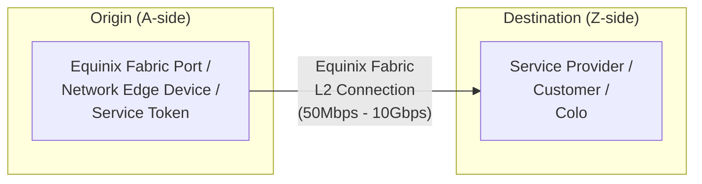

# Equinix Fabric L2 Connection Terraform module

[](https://github.com/equinix-labs/standards#about-uniform-standards)
[](https://github.com/equinix-labs/terraform-equinix-template/actions/workflows/integration.yaml)

`terraform-equinix-fabric-connection` is a minimal Terraform module that
utilizes the [Terraform provider for Equinix](https://registry.terraform.io/providers/equinix/equinix/latest)
to set up an Equinix Fabric L2 connection.

As part of Platform Equinix, your infrastructure can connect with other
parties, such as public cloud providers, network service providers, or your own
colocation cages in Equinix by defining an [Equinix Fabric - software-defined interconnection](https://docs.equinix.com/en-us/Content/Interconnection/Fabric/Fabric-landing-main.htm).



--> **NOTE:**
To establish an Equinix Fabric connection, you need to combine and configure
various parameters based on the types of origin and destination. Additionally,
you must configure the platform of the service you are connecting to, such as
creating an Interconnect Attachment in Google Cloud platform or approving a
Direct Connect request in AWS. While this module can be utilized independently,
its primary purpose is to be utilized by other service-specific modules. This
abstraction simplifies the process and includes all the required configuration
on the target platform.

Please click on the link below to explore the available service-specific
modules:

[Available service-specific modules](https://registry.terraform.io/search/modules?namespace=equinix-labs&q=fabric-connection)

## Usage

Please note that this project is experimental and is supported by the user
community. Equinix does not provide support for this project.

To install Terraform, please refer to the official guides at [Install Terraform](https://learn.hashicorp.com/tutorials/terraform/install-cli).

You are free to fork, clone, or download this project and modify it as needed
for your integrations and deployments.

Additionally, you can use this project as a [Terraform module](https://learn.hashicorp.com/collections/terraform/modules).

To utilize this module in a new project, create a file such as:

```hcl
# main.tf
provider "equinix" {}

module "equinix_fabric_connection" {
  source = "equinix-labs/fabric-connection/equinix"

  # required variables
  notification_users = ["example@equinix.com"]

  # optional variables
  seller_profile_name      = "Azure ExpressRoute"
  seller_metro_code        = "FR"
  seller_authorization_key = "Express-Route-Service-Key"
  port_name                = "Fabric-Port-FR-Pri"
  vlan_stag                = 1010
  named_tag                = "PRIVATE"
  redundancy_type          = "REDUNDANT"
  secondary_port_name      = "Fabric-Port-FR-Sec"
  secondary_vlan_stag      = 1020
}
```

Run `terraform init -upgrade` and `terraform apply`.

<!-- BEGIN_TF_DOCS -->
<!-- END_TF_DOCS -->

## Examples

- [Fabric Port connection to Service Provider](https://registry.terraform.io/modules/equinix-labs/fabric-connection/equinix/latest/examples/fabric-port-connection-to-sp/)

## Contributing

If you would like to contribute to this module, see the [CONTRIBUTING](CONTRIBUTING.md)
page.

## License

Apache License, Version 2.0. See [LICENSE](LICENSE).
